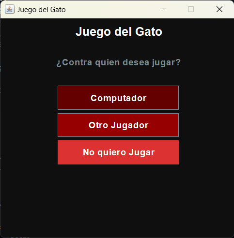
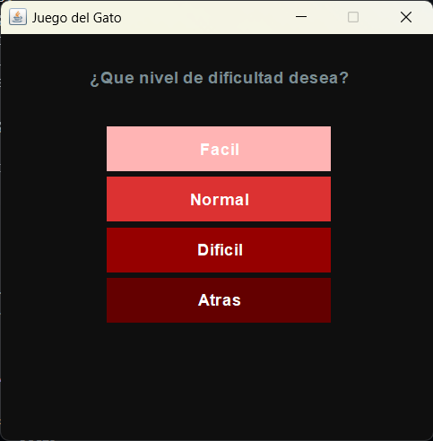
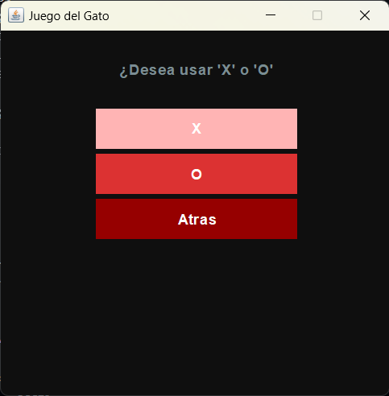
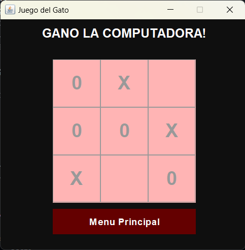

# Juego-del-gato-minmax

Básicamente se trata de hacer el juego del gato o TIC TAC TOE en java con el algoritmo Minimax

A continuacion se muestra la pantalla principal del juego

Una vez seleccionamos la opcion del Computador nos aparece la siguiente pantalla:

Al seleccionar la dificultad podemos indicar con que queremos jugar, ya sea con las X o con los 0

Una vez seleccionamos esto ahora si nos dejara jugar

LOGICA

1. Todo comienza con la creación de un objeto de la clase MinMax en Gato1 en la línea 27.
   
2. Los JButton boton[] en las posiciones 0, 1, 2 (los cuales son los que indican Fácil, Normal, Difícil respectivamente) no solo cambian opciones de diseño, sino que proporcionan valores 1, 5, 9 respectivamente a nivdif, una variable que en otra sección del código se encargará de la profundidad de búsqueda en el árbol.

3. Cuando se presiona cualquiera de los botones anteriores, se abre una nueva ventana con las opciones para X o 0. Estas opciones son importantes ya que ayudan a iniciar ciertas variables, como teamX y team0. Estas son booleanas y cambiarán de valor según lo que elijas. No solo eso, sino que también se les da valores a targetHuman y targetPC, las cuales se usarán más adelante para determinar el texto que se pondrá en los botones con cada movimiento.
   
4. Dentro de estos botones aparece la llamada a turno(), un método que aleatoriamente determina a quién le corresponde jugar. Esto es aleatorio y puede ser tú o la computadora.
   
5. Se llama a MiniMax.
    
MINMAX

6. En la línea 152 se inicializan bestRow y bestColumn, esto simplemente es para darles un valor inicial.

7. En la línea 154 se inicializa max con el menor valor posible en Int.
    
8. Ahora el ciclo for va a revisar cada elemento de la matriz. Es aquí donde inicia lo importante.
    
9. El ciclo if comprueba secciones en las que no haya ni X ni 0. Esto lo hace mediante la matriz gameValues, la cual usa 0 para espacio vacío, 1 para el jugador humano y 2 para la máquina.
    
10. Una vez que entra en el ciclo, lo que hace el código es crear variables temporales para guardar modificaciones.
    
11. Se le da a la matriz en esa posición el valor 2, esto quiere decir que se está creando un nodo que representa un movimiento de la computadora, y se guarda esa posición en tempRow y tempColumn.
    
12. La línea 163 llama a ValorMin, enviándole la profundidad de cero, el valor mínimo posible para Int y el mayor valor posible para Int. La siguiente línea en esta misma sección arregla la matriz gameValues porque se supone que ese movimiento no ocurrió, en realidad es una predicción. Sin embargo, es importante ver lo que pasa antes en la llamada a ValorMin.
    
13. Recordemos que MinMax hizo un movimiento ficticio de la computadora en la posición vacía. Ahora ValorMin se va a encargar de hacer el siguiente movimiento ficticio del jugador basado en el movimiento de la computadora. Las primeras líneas son irrelevantes por el momento, lo que importa es la línea 197 en adelante donde vuelve a revisar toda la matriz.
    
14. En esta sección hay un ciclo for muy parecido al que había en MinMax. Este se encarga de colocar el movimiento del jugador en la siguiente posición vacía.
    
15. Una vez hecho esto, la línea 205 hace una llamada a ValorMax. Lo que hace es llamar a ValorMax. En esta parte se está aumentando el valor a depth + 1, asemejándose a un aumento en la profundidad del árbol.

16. En ValorMax se está realizando algo exactamente igual a lo que ocurre en ValorMin y llama a ValorMin.

17. De esa manera, MinMax llama a ValorMin, luego ValorMin llama a ValorMax y ValorMax vuelve a llamar a ValorMin, así hasta que las condiciones iniciales de las líneas 224 y 226 se cumplan, es decir, haya un ganador o la matriz esté llena. Esto cerrará este ciclo y volverá a MiniMax, pero recordemos que en MiniMax hay otro ciclo. En realidad, hicimos la predicción para todo un subárbol, y ahora en el ciclo de MiniMax volveremos a hacer un miniarbol de análisis para otro posible movimiento.

18. Ahora bien, cabe recalcar algo que no se ha mencionado y es la llamada a heuristics y a Cost. Heuristics llama a Cost. Estos dos se encargan de determinar básicamente el costo de cada conjunto de jugadas predichas. Esto lo hace analizando la profundidad a la que se entró y este tipo de cosas. Este valor se le regresa a MiniMax, quien lo compara con el valor máximo existente, ayudando a elegir así la mejor línea de árbol.

